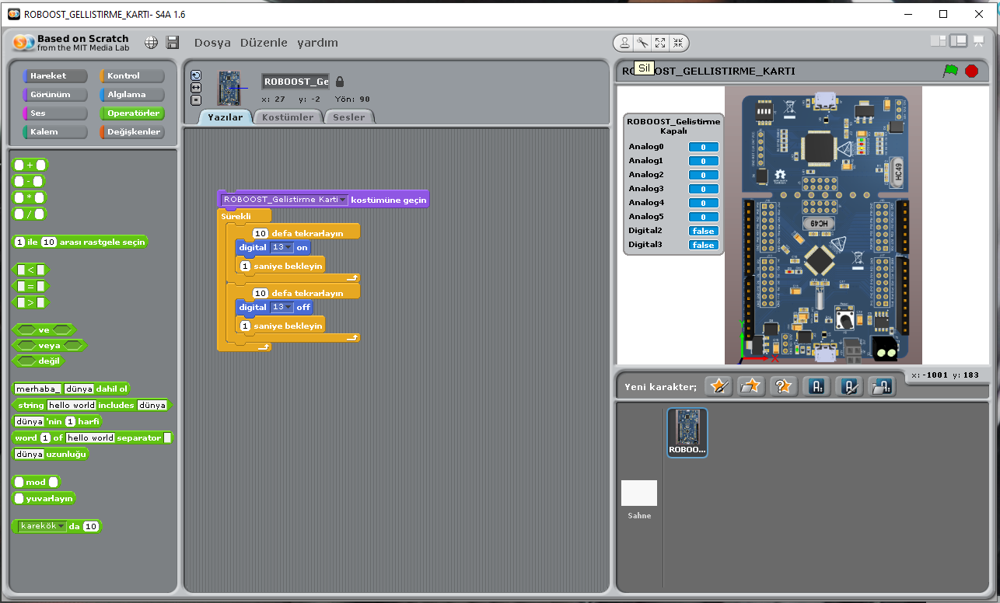
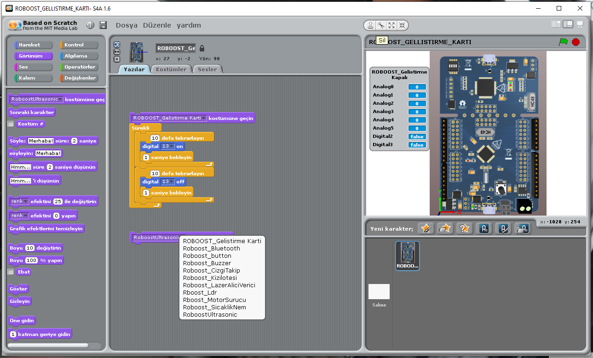
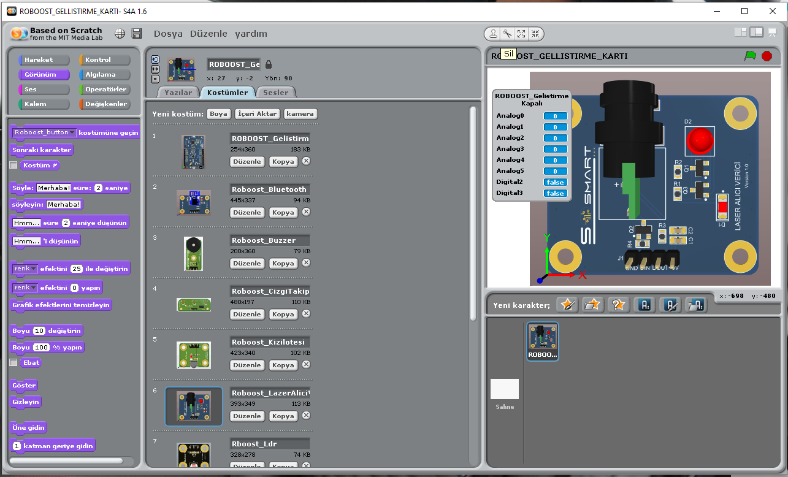
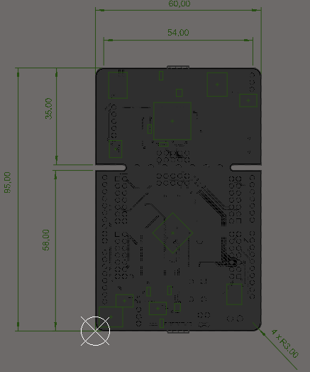

# 
# Türkçe

- [Scratch IDE için Roboost Maker kart paketi](#scratch-ide-için-robust-maker-kart-paketi)
- [Kurulum Öncesi Adımlar](#kurulum-öncesi-adımlar)
- [Paket Kurulum Adımları](#paket-kurulum-adımları)
- [Resimler](#resimler)
- [Gerekli Sürücüler](#gerekli-sürücüler)
- [Sorumluluk Reddi](#sorumluluk-reddi)
- [Önemli Uyarı](#önemli-uyarı)
- [Geliştirme Kartı](#geliştirme-kartı)
- - [Kapsam](#kapsam)
- - [Ürün Parametreleri](#ürün-parametreleri)
- - [Mekanik](#mekanik)
- - [Pin Açıklamaları](#pin-açıklamaları)
- - [Geliştirme Kartı Pin Şeması](#geliştirme-kartı-pin-şeması)
- - [Genel Bakış](#genel-bakış)
# Scratch IDE için Roboost Maker kart paketi
Bu depo, Roboost Maker kart için Scratch ide uyumluluk dökümanları ve paketlerini içerir.

Roboost maker kart'a yüklenecek ufak bir firmware ile Roboost maker kartı S4A scratch ile uyumlu şekilde çalışmaktadır.

# Kurulum öncesi adımlar

Kurulumdan önce bilgisayarınıza Roboost ide veya Roboost Maker kart paketi ile Arduino IDE yüklü olmalıdır. İlgili ide dökümanları ve kaynak kodları ve kurulum dosyaları aşağıdaki linklerde bulunmaktadır.

Roboost ide Github linki:

Arduino IDE için Roboost Maker kart paketi:

# Paket Kurulum Adımları

- Roboost Maker kart USB ile bilgisayara bağlanır.
- ROBOOST IDE menüsünden S4A(Scratch for Arduino) firmware paketi açılır.

veya 

- Roboost eklentisi eklenmiş Arduino IDE ile "firmware/ROBOOST_S4AFirmware.ino dosyası açılır.

- Araçlar menüsünden Roboost Geliştirme Kartı ve kartın bulunduğu seri port seçilir.

- Dosya -> Yükle seçeneği seçilerek ROBOOST_S4AFirmware.ino dosyası karta yüklenir.

- S4A16.zip dosyası içerisindeki S4A16.exe dosyası çalıştırılır.

Tüm işlemler sonucunda S4A(Scratch for Arduino) yazılımı Roboost Geliştirme kartına uyumlu olarak çalıştırılır.

Yukarıdaki örnekte 13 numaralı pine bağlı olan ledi 1 saniye aralıklarla yakıp söndüren Scratch blokları görsel olarak eklenmiştir.

Yukarıdaki görselde Roboost Sensör bloklarının Scratch da nasıl seçileceği gösterilmiştir.

Yukarıdaki görselde Roboost Sensör kartlarının ve Roboost Geliştirme kartlarının bloklar halinde "Kostümler" menüsüne eklenmiş hali gösterilmektedir.

- S4A(Scratch For Arduino) yazılımı kaynak kodları S4ADev.zip klasöründe yeralmaktadır. S4A yazılımı hakkında detaylı bilgi için http://s4a.cat/ .

# Gerekli Sürücüler

- Roboost Geliştirme kartına bağlanmak için ihtiyaç duyulması halinde gerekli sürücüler "drivers.zip" dosyası içerisindedir.

# Sorumluluk Reddi
Yazılım, performans veya sonuçlara ilişkin garanti olmaksızın "OLDUĞU GİBİ" sunulur ve performans veya sonuçlara ilişkin tüm risk "SİZE" aittir.
SoSmart, satılabilirlik, belirli bir amaca uygunluk ve fikri mülkiyet haklarının ihlal edilmemesine ilişkin tüm garantiler 
dahil ancak bunlarla sınırlı olmamak üzere Yazılım, kullanımı veya işletimi ile ilgili açık, ima edilen veya başka türlü tüm garantileri reddeder.

# Önemli Uyarı
SoSmart Ürünleri, herhangi bir arıza veya arızanın insan yaşamının kaybına, bedensel yaralanmaya veya ciddi maddi hasara neden olabilecek sistemlerde veya ekipmanlarda kullanılması amaçlanmamıştır veya bu ürünler için garanti verilmemektedir. Bu tür uygulamalar "Güvensiz Kullanım" olarak kabul edilir.

Güvenli olmayan kullanım şunları içerir, ancak bunlarla sınırlı değildir: cerrahi uygulama için ekipman, atom enerjisi kontrol aletleri, uçak veya uzay gemisi aletleri, araç kullanımı için tasarlanmış dinamik, fren veya güvenlik sistemlerinin kontrolü veya çalıştırılması, trafik sinyal aletleri, her türlü güvenlik cihazı ve yaşamı desteklemeyi veya sürdürmeyi amaçlayan diğer uygulamalar.

Tüm Güvensiz Kullanımların riski müşteriye ait olacaktır ve müşterinin Güvensiz Kullanımı sonucunda üçüncü şahısların SoSmart üzerinde hak iddia etmesi durumunda, müşteri SoSmart'ın bu nedenle uğradığı zararları ve yükümlülükleri tazmin edecektir.

Lütfen tüm verilerin ve özelliklerin önceden haber verilmeksizin değiştirilebileceğini unutmayın. Bu veri sayfasında adı geçen tüm ürün ve şirketlerin ticari markaları ilgili sahiplerine aittir.

# Geliştirme Kartı

### Kapsam

Bu döküman Geliştirme Kart'ının tanımını ve çalışma prensibini açıklar.

### Ürün Parametreleri

-  Çalışma Gerilimi: DC +5V
-  Çalışma Sıcaklığı:-40 ℃ ~ +105 ℃ 
-  İşlemci Mimarisi: ARM® Cortex™-M0 core
-  Çalışma Frekansı: 72MHz'e kadar çalışır.
-  Seri haberleşme : 4 adet UART 1 adet SPI 2 adet I^2C 1 adet USB 1 adet LIN 1 adet CAN
- 4 adet PWM pini
- 7 adet ADC pini
- APROM 64 KB
- RAM 8KB
- DATA FLASH 4KB
- ISP ROM 8KB
- I/O 31 adet.
- Timer (32 bit) 4 adet.
- USB ve hassas zamanlama işlemi için harici 4~24 MHz yüksek hızlı kristal osilatör.
- RTC işlevi ve düşük güç sistemi için harici 32.768 kHz düşük hızlı kristal osilatör.

### Mekanik

### Pin Açıklamaları

|Pin Numarası|Pin Adı|Pin Tipi|Açıklama|
|------|------|------|------|
|1|Vbat|P|Batarya ile besleme pimi|
|2|X32_OUT|O|Harici 32.768 kHz kristal osilatör çıkış pini.|
|3|X32_IN|I|Harici 32.768 kHz kristal osilatör giriş pini.|
|4|PA.11-I2C1_SCL-CAN1_RXD|I/O-I/O-I|Genel amaçlı dijital I/O pini-I2C1 Clok pimi-CAN1 için data alıcı giriş pini|
|5|PA.10-I2C1_SDA-CAN1_TXD|I/O-I/O-O|Genel amaçlı dijital I/O pini-I2C0 Clok pimi-CAN1 için data verici çıkış pini|
|6|PA.9-I2C0_SCL|I/O-I/O|Genel amaçlı dijital I/O pini-I2C0 için clock pini|
|7|PA.8-I2C0_SDA|I/O-I/O|Genel amaçlı dijital I/O pini-I2C0 için data giriş-çıkış pini|
|8|PB.4-UART1_RXD|I/O-I|Genel amaçlı dijital I/O pini-UART1 için data alıcı pini|
|9|PB.5-UART1_TXD|I/O-O|Genel amaçlı dijital I/O pini-UART1 için data verici pini|
|10|LDO_CAP|P|LDO çıkış pini|
|11|VDD|P|I/O için güç kaynağı PLL ve dijital devre için LDO kaynağı|
|12|Vss|P|Dijital devre için topraklama pini|
|13|USB_VBUS|USB|USB HOST yada HUB için güç kaynağı|
|14|USB_Vdd33_CAP|USB|Dahili güç regülatörü çıkışı 3.3 V dekuplaj pini|
|15|USB_D-|USB|USB diferansiyel sinyali D-|
|16|USB_D+|USB|USB diferansiyel sinyali D+|
|17|PB.0-UART0_RXD|I/O-I|Genel amaçlı dijital I/O pini-UART0 için data alıcı pini|
|18|PB.1-UART0_TXD|I/O-O|Genel amaçlı dijital I/O pini-UART0 için data verici pini|
|19|PD.6-CAN0_RXD|I/O-I|Genel amaçlı dijital I/O pini-CAN0 için data alıcı pini|
|20|PD.7-CAN0_TXD|I/O-I|Genel amaçlı dijital I/O pini-CAN0 için data verici pini|
|21|PC.3-SPI_MOSI0-I2S_DO|I/O-I/O-O|Genel amaçlı dijital I/O pini-1.SPI0 MOSI (Master Out, Slave In) pini-I2S data çıkışı|
|22|PC.2-SPI0_MISO0-I2S_DI|I/O-I/O-I|Genel amaçlı dijital I/O pini-1.SPI0 MISO (Master out, Slave In) pini-I2S data girişi|
|23|PC.1-SPI0_CLK-I2S_BCLK|I/O-I/O-I/O|Genel amaçlı dijital I/O pini-SPI0 seri clock pini-I2S bit clock pini|
|24|PC.0-SPI0_SS0-I2S_LRCLK|I/O-I/O-I/O|Genel amaçlı dijital I/O pini-1.SPI0 slave seçme pini-I2S sol-sağ kanal clock|
|25|PA.15-PWM3-I2S_MCLK|I/O-I/O-O|Genel amaçlı dijital I/O pini- PWM3 çıkışı-I2S master clock çıkış pini|
|26|PA.14-PWM2|I/O-I/O|Genel amaçlı dijital I/O pini- PWM2 çıkışı|
|27|PA.13-PWM1-UART5_TXD|I/O-I/O-O|Genel amaçlı dijital I/O pini-PWM1 çıkışı-UART5 için data verici pini|
|28|PA.12-PWM0-UART5_RXD|I/O-I/O-I|Genel amaçlı dijital I/O pini-PWM0 çıkışı-UART5 için data alıcı pini|
|29|ICE_DAT|I/O|Seri hata ayıklayıcı veri pini|
|30|ICE_CLK|I| Seri hata ayıklayıcı clock pini|
|31|AVss|AP|Analog devre için topraklama pini|
|32|PA.0-ADC0-SC0_PWR|I/O-AI-O|Genel amaçlı dijital I/O pini-ADC0 analog girişi-SmardCard0 güç girişi|
|33|PA.1-ADC1-SC0_RST|I/O-AI-O|Genel amaçlı dijital I/O pini-ADC1 analog girişi-SmartCard0 reset pini|
|34|PA.2-ADC2-SC0_CLK-UART3_TXD|I/O-AI-O-O|Genel amaçlı dijital I/O pini-ADC2 analog girişi-SmartCard0 clock pini-UART3 için data verici pini|
|35|PA.3-ADC3-SC0_DAT-UART3_RXD|I/O-AI-O-I|Genel amaçlı dijital I/O pini-ADC3 analog girişi|SmartCard0 veri pini|UART3 için data alıcı pini|
|36|PA.4-ADC4|I/O-AI|Genel amaçlı dijital I/O pini-ADC4 analog girişi|
|37|PA.5-ADC5|I/O-AI|Genel amaçlı dijital I/O pini-ADC5 analog girişi|
|38|PA.6-ADC6|I/O-AI|Genel amaçlı dijital I/O pini-ADC6 analog girişi|
|39|Vref|AP|ADC için voltaj referans pini|
|40|AVdd|AP|Dahili analog devre için güç kaynağı|
|41|PC.7-ACMP0_N|I/O-AI|Genel amaçlı I/O pini-Comparator0 negatif giriş pini|
|42|PC.6-ACMP0_P-SC-CD|I/O-AI-I|Genel amaçlı dijital I/O pini-Comprator0 pozitid giriş pini-SmartCard0 kart algılama pini|
|43|PB.15-INT1-TM0_EXT-TM0|I/O-I-I-O|Genel amaçlı dijital I/O pini-Harici interrupt1 giriş pini-Timer0 harici  giriş pini-TM0 geçiş çıkış pini|
|44|PF.0-XT1_OUT|I/O-O|Genel amaçlı dijital I/O pini-Harici 4~24 MHz(yüksek hızlı) kristal osilatör çıkış pini|
|45|PF.1-XT1_IN|I/O-I|Genel amaçlı dijital I/O pini- Harici 4~24 MHz(yüksel hızlı) kristal osilatör giriş pini|
|46|nRESET|I|Harici sıfırlama girişi: Active Low|
|47|PVss|P|PLL ground|
|48|PB.8-STADC-TM0-CLKO|I/O-I-I/O-O|Genel amaçlı dijital I/O pini-ADC dahili tetikleme giriş pini-Timer0 olay sayacı girişi / geçiş çıkışı- Frekans bölücü clock çıkış pini|

### Geliştirme Kartı Pin Şeması

### Genel Bakış 

Geliştirme Kartı çevre ile etkileşime giren sistemler yapmada, sensörlerden gelen verileri kullanarak yapılacak uygulamalarda, akıllı ev sistemleri oluşturmada, hareketli nesneler tasarlama gibi birçok alanda kullanım özelliği gösterebilir. Prototiplemeye imkan sağlaması, çeşitli devrelerde rahatça kullanılabilmesi için gerekli pinler devre kartı sayesinde dışarıya alınmıştır. Jumper kablolar ile bağlantıları yapılabilir. Mikrodenetleyici olarak NUC240LD2AE kullanılmıştır.

**Kopya (C) 2022 SoSmart Technology Corp. All rights reserved**
